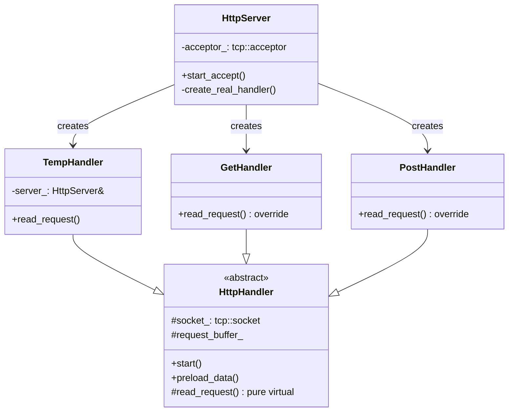

[boost库windows下安装](https://llfc.club/category?catid=225RaiVNI8pFDD5L4m807g7ZwmF#!aid/2LUMUrk6n3nNEMHUOyWFwiPZZyo)

```mermaid
classDiagram
    class HttpServer {
        -acceptor_: tcp::acceptor
        +start_accept()
        -create_real_handler()
    }
    
    class TempHandler {
        -server_: HttpServer&
        +read_request()
    }
    
    class HttpHandler {
        <<abstract>>
        #socket_: tcp::socket
        #request_buffer_
        +start()
        +preload_data()
        #read_request() pure virtual
    }
    
    class GetHandler {
        +read_request() override
    }
    
    class PostHandler {
        +read_request() override
    }
    
    HttpServer --> TempHandler : creates
    HttpServer --> GetHandler : creates
    HttpServer --> PostHandler : creates
    TempHandler --|> HttpHandler
    GetHandler --|> HttpHandler
    PostHandler --|> HttpHandler
```